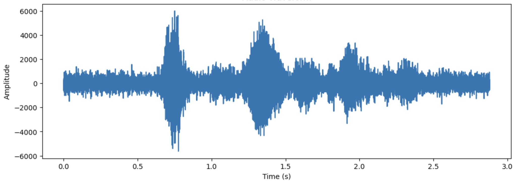
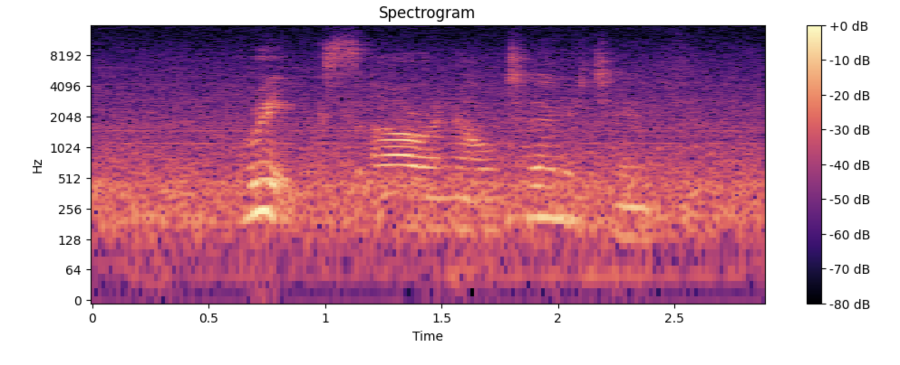

# 🎤 Whisper Audio Transcription

## Overview
This project utilizes **OpenAI's Whisper model** for **speech-to-text transcription** and evaluates transcription accuracy using **Word Error Rate (WER) and Character Error Rate (CER)**. It also includes **audio waveform and spectrogram visualizations**.

## Features
- 🎙 **Speech-to-Text Transcription**
- 📊 **WER & CER Accuracy Metrics**
- 🎼 **Waveform & Spectrogram Analysis**

## Dataset
🔗 [VidTIMIT Audio/Video Dataset](https://www.kaggle.com/datasets/crazyt/vidtimit-audiovideo-dataset)


## Usage
```bash
python transcribe_audio.py --audio sample_audio.wav
```

## Output
- **Transcribed Text**
- **WER & CER Scores**
- **Waveform & Spectrogram Visualizations**

### Audio Waveform


### Spectrogram


